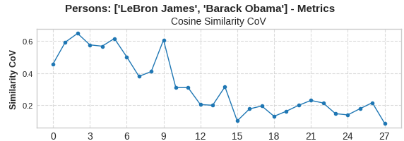

# Diving into the MLP

### What did we get done?

* Gave evidence **strengthening the intuition that early MLP layers may receive what we call an “entity”**, for example “LeBron James” or “Barack Obama” as input and output its attributes (e.g. wife). **As opposed to being asked a concept specific query**, like “Wife of LeBron James” and outputting its answer.

### Why did we do it? 

* To understand the input/output “types” of the MLP responsible for connections between entities (e.g. who is LeBron James’ wife). The input type apparently is the general entity as opposed to the context specific value.  
* To locate the MLP responsible for enriching knowledge about a specific concept.

### What did we do?

* **Calculated the variance of the cosine similarity between every MLP output and one control output for many different questions about one “entity”** (e.g. Lebron James, Lion). We specifically looked at the last token of the entity’s name (e.g. “Who is the wife of LeBron James”, “What city is the birthplace of LeBron James?” Focusing on the token “James”).

### What exactly did we discover?

* We found **early MLP layers where the cosine similarity variance is especially small between prompts about the same subject**, but high between subjects (e.g. between LeBron and Obama).  
  This *may suggest* these low variance MLPs get excited by the subject and output the same info related to it regardless of context\!

## The Process

***Reminder**: we are working on the intuition (developed by the incredible Mor Geva) that the MLP layer functions as a key-value store, where keys capture patterns like “LeBron James” and values store attributes about him (such as “Savannah James”, his wife).*

We want to prove that there is an MLP that takes just “Lebron James”, clean of context, as “input” and would output all info about him.  
After some brainstorming we decided that if we find an MLP layer whose output is fairly constant across questions about a specific person, **it means it doesn’t respond to the context but to the entity itself** and it may just give all info about it. **Its “input type” then would be the entity itself and not prompt-specific context.**

## The Experiment

* Generate prompts asking for info about LeBron James and Barack Obama \- the name must be at the end of the prompt so it’s able to soak up the context in the attention layer in the case the MLP does take in context-specific inputs  
* Run each through Qwen2.5-7B  
* Using [NNsight](http://nnsight.net), save the output of each one of the MLP layers for each prompt, for the last token in the name (e.g. “James”/”Obama”)  
* **Check the variance of the cosine similarity of each output between each layer and a control output** between different prompts about each subject, and then in between the different subjects. We took the first question in every batch as the control.

When we had this experiment outlined we let ChatGPT o1 take the wheel :) 

## The Results

**x axis is layer number, y axis is the coefficient of variance of the cosine similarities.**  
![][image1]![][image2]![][image3]

**We see that the variance for Lebron James is consistently low for layer 1 and for Barack Obama in layer 2, but high in all layers for the mix of questions about both\!**  
**We then scaled for many more people** **and animals** (Harry Potter, Trump, Lion, Elephant, etc.) and saw they all consistently had an early MLP with especially low variance of outputs between different questions for the target’s name’s last token\!  
**We also saw that low variance MLP stays the same layer across languages** **and aliases\!** (Chinese and Arabic specifically and aliases like FDR \<\> Franklin Roosevelt).  

